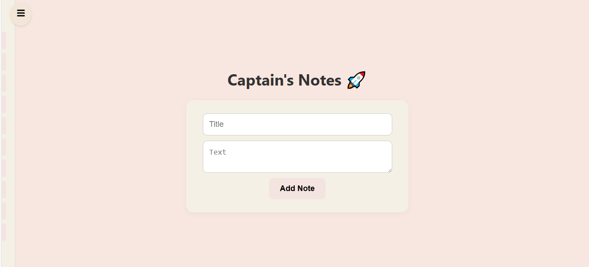
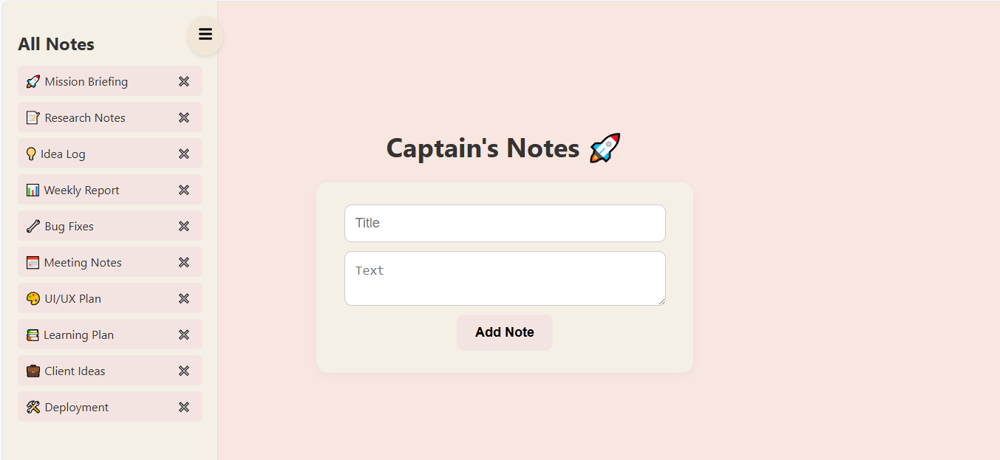
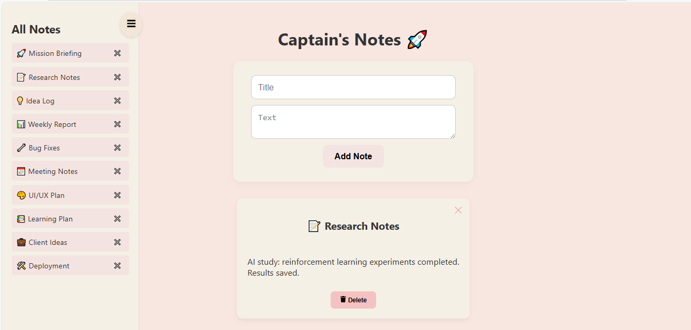

# Captain's Notes 🚀

A clean, pastel-themed note-taking web app built with **React** for the frontend and **Node.js + Express + MongoDB** for the backend.  

Keep track of your thoughts, ideas, and tasks in style. 🌸

---

## Features

- ✨ **Add Notes** – Title and text with a pastel aesthetic form.
- 📝 **View Notes** – Click the sidebar to see all saved notes.
- ❌ **Delete Notes** – Remove notes you no longer need.
- 📂 **Sidebar Navigation** – Smooth, interactive sidebar for easy note access.
- 🌈 **Responsive Design** – Works perfectly on mobile and desktop.
- 🎨 **Pastel Theme** – Beautiful beige, rosy, and tea pink shades.

---

## Tech Stack

- **Frontend:** React, React Icons, Axios
- **Backend:** Node.js, Express
- **Database:** MongoDB
- **Styling:** Inline styles with pastel aesthetic
- **Version Control:** Git & GitHub

---

## Screenshots

  
  
  

---

## Installation

1. Clone the repo:
   ```bash
   git clone https://github.com/layba-glitch/Captain-s-Notes.git

2. Go to backend and install dependencies:

   ```bash
   cd backend
   npm install
   ```
3. Go to frontend and install dependencies:

   ```bash
   cd ../client
   npm install
   ```
4. Run the backend:

   ```bash
   cd ../backend
   npm start
   ```
5. Run the frontend:

   ```bash
   cd ../client
   npm start
   ```

---

## Usage

* Open the app in your browser.
* Add a title and note in the main form.
* Click the **sidebar icon** to view all notes.
* Click a note to open it.
* Click the **trash icon** to delete a note.

---

## Contributing

Contributions are welcome! If you want to improve styling, add new features, or optimize performance, feel free to create a pull request.

---

## License

MIT License © 2025 Layba-glitch

